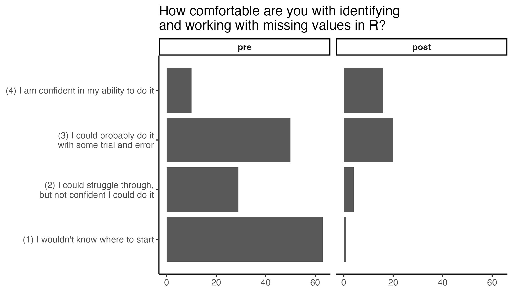
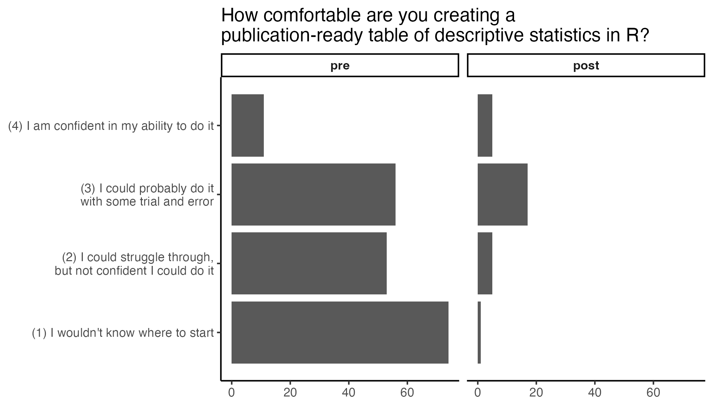
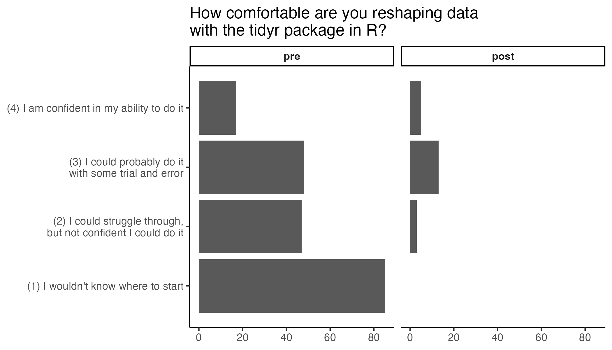
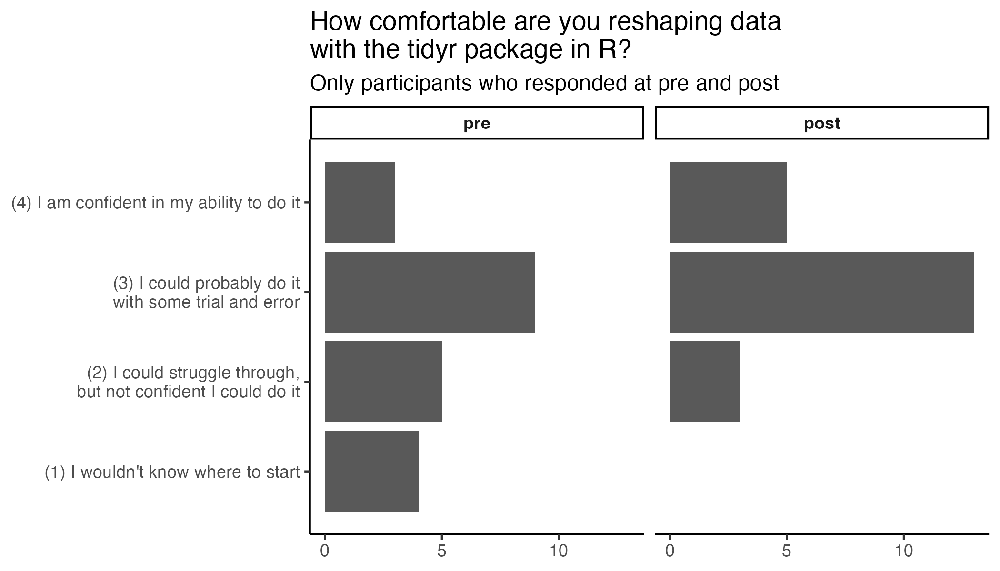

R102 Workshop Analysis
================
Rose Hartman
2024-05-28

``` r
library(ggplot2)
library(dplyr)
```

    ## 
    ## Attaching package: 'dplyr'

    ## The following objects are masked from 'package:stats':
    ## 
    ##     filter, lag

    ## The following objects are masked from 'package:base':
    ## 
    ##     intersect, setdiff, setequal, union

``` r
library(tidyr)
library(tidyselect)
library(lubridate)
```

    ## 
    ## Attaching package: 'lubridate'

    ## The following objects are masked from 'package:base':
    ## 
    ##     date, intersect, setdiff, union

``` r
# API tokens stored in .Renviron https://cran.r-project.org/web/packages/httr/vignettes/secrets.html#environment-variables

# pull data from redcap
r102_formData <- list("token"=Sys.getenv("R102_registration_65259"),
                          content='record',
                          action='export',
                          format='csv',
                          type='flat',
                          csvDelimiter='',
                          rawOrLabel='raw',
                          rawOrLabelHeaders='raw',
                          exportCheckboxLabel='false',
                          exportSurveyFields='true',
                          exportDataAccessGroups='false',
                          returnFormat='json'
)
r102_response <- httr::POST("https://redcap.chop.edu/api/", body = r102_formData, encode = "form")
r102_raw <- httr::content(r102_response, show_col_types = FALSE) 
```

``` r
date_max <- function(dates){
  if(all(is.na(dates))) {
    return(as.Date(NA)) 
  } else {
    return(max(dates, na.rm = TRUE))
  }
}

num_max <- function(numbers){
  if(all(is.na(numbers))) {
    return(NA) 
  } else {
    return(max(numbers, na.rm = TRUE))
  }
}
  
attend_max <- function(attend){
  
  levels <- c("no", "watch", "attend")
  
  if(all(is.na(attend))) {
    return(factor(NA, levels = levels)) 
  } else if("attend" %in% attend) {
    return(factor("attend", levels = levels))
  } else if("watch" %in% attend){
    return(factor("watch", levels = levels))
  } else if("no" %in% attend){
    return(factor("no", levels = levels))
  } else 
    stop()
}
```

``` r
r102 <- r102_raw |> 
  # clean up dates with lubridate
    mutate(signup_date = ymd_hms(form_1_timestamp, quiet = TRUE),
                mar_followup_date = ymd_hms(missing_values_in_r_follow_up_timestamp, quiet = TRUE),
                apr_followup_date = ymd_hms(summary_stats_in_r_follow_up_timestamp, quiet = TRUE),
                may_followup_date = ymd_hms(reshaping_data_in_tidyr_follow_up_timestamp, quiet = TRUE),
                jun_followup_date = ymd_hms(data_types_and_viz_follow_up_timestamp, quiet = TRUE)) |> 
  # force all email to lowercase
  mutate(email = tolower(email)) |> 
  # select the columns to analyze
  select(email, 
         record_id,
         ends_with("_date"), 
         starts_with("attend_"),
         starts_with("select_workshops_"),
         ends_with("_complete"), 
         missing_values, 
         missing_values_2,
         create_table,
         create_table_2,
         tidyr,
         tidyr_2,
         data_types,
         data_types_2,
         ggplot2,
         ggplot2_2
         ) |> 
  # combine data from duplicate entries (people who registered more than once with the same email)
  group_by(email) |> 
  summarise(
    across(starts_with("attend_"), attend_max),
    across(ends_with("_date"), date_max),
    across(!starts_with("attend_")&!ends_with("_date"), num_max),  
    .groups = "drop") |> 
  # extract organization from email address
  tidyr::extract(email, into = "org", 
                 regex = "[^@]+@(.*)[.]edu", 
                 remove = FALSE) |> 
  # clean up org categories
  mutate(org = case_when(grepl(x=org, pattern = "chop") ~ "CHOP",
                                       grepl(x=org, pattern = "upenn") ~ "Penn",
                                       TRUE ~ "Other"),
                org = as.factor(org))  
  
  
plot_data <- r102 |> 
  select(record_id, 
         missing_values_1 = missing_values, 
         create_table_1 = create_table,
         tidyr_1 = tidyr,
         data_types_1 = data_types,
         ggplot2_1 = ggplot2, 
         ends_with("_2")) |> 
  tidyr::pivot_longer(-record_id, values_to = "ability") |> 
  tidyr::extract(name, into=c("topic", "event"), regex="(.*)_([12])") |> 
  mutate(event = factor(event, levels = 1:2, labels = c("pre", "post"))) 
```

``` r
ability_plot <- function(df){
  base_plot <- df |> 
  filter(event %in% c("pre", "post")) |> 
  ggplot(aes(y=ability)) + 
  geom_bar() +
  # geom_histogram(bins = 6) + 
  facet_wrap(~event) +
  scale_y_continuous(breaks = 1:4, limits = c(.5,4.5),
                     labels = c("(1) I wouldn't know where to start",
                                "(2) I could struggle through,\nbut not confident I could do it",
                                "(3) I could probably do it\nwith some trial and error",
                                "(4) I am confident in my ability to do it")) + 
    theme_classic() + 
    labs(x=NULL, y=NULL) + 
   theme(
    strip.text = element_text(face = "bold"),
    strip.background = element_rect(colour = "black", size = 1))
  
  return(base_plot)
}
```

``` r
print_p <- function(p, digits = 3, eval=TRUE){
  if(eval){
    if (p < .001){
    p_statement <- "p < .001"
  } else {
    format <- paste0("%0.", digits, "f")
    p_statement <- paste0("p = ", sub(pattern = "^0", replacement = "", x=sprintf(format, p)))
  }
  }
}

print_lm <- function(model, digits = 2, digits_p = 3, eval=TRUE){
  if(eval){
    format <- paste0("%0.", digits, "f")
  
  rsq <- summary(model)$r.squared
  f <- summary(model)$fstatistic["value"]
  df1 <- summary(model)$fstatistic["numdf"]
  df2 <- summary(model)$fstatistic["dendf"]
  p <- pf(f,df1,df2, lower.tail = FALSE)
  paste0("R² = ", print_r(rsq, digits), ", F(", df1, ", ", df2, ") = ", sprintf(format, f), ", ", print_p(p, digits_p))
  }
}

print_t <- function(ttest, digits = 2, digits_p = 3, eval=TRUE){
  if(eval){
    format <- paste0("%0.", digits, "f")
  
  paste0("t(", ttest$parameter, ") = ", sprintf(format, ttest$statistic), ", ", print_p(ttest$p.value, digits_p) )
  }
}
```

``` r
eval_mar = sum(r102$missing_values_in_r_follow_up_complete == 2) > 0
eval_apr = sum(r102$summary_stats_in_r_follow_up_complete == 2) > 0
eval_may = sum(r102$reshaping_data_in_tidyr_follow_up_complete == 2) > 0
eval_jun = sum(r102$data_types_and_viz_follow_up_complete == 2) > 0
```

## Missing Values in R

155 signups.

47 responses on post-workshop survey.

All available responses at pre and post:

``` r
p <- plot_data |> 
  filter(topic == "missing_values") |> 
  ability_plot() +
  labs(title = "How comfortable are you with identifying\nand working with missing values in R?")
```

    ## Warning: The `size` argument of `element_rect()` is deprecated as of ggplot2 3.4.0.
    ## ℹ Please use the `linewidth` argument instead.
    ## This warning is displayed once every 8 hours.
    ## Call `lifecycle::last_lifecycle_warnings()` to see where this warning was
    ## generated.

``` r
ggsave("prepost_03_all.png", 
       plot = p,
       height = 4, width = 7, units = "in")
```

    ## Warning: Removed 291 rows containing non-finite outside the scale range
    ## (`stat_count()`).



Just folks who did respond at post:

``` r
p <- plot_data |> 
  filter(topic == "missing_values") |> 
  # remove folks who are NA for either pre or post
  tidyr::pivot_wider(names_from = event, values_from = ability) |> 
  na.omit() |> 
  # pivot back to long for plotting
  tidyr::pivot_longer(pre:post, names_to = "event", values_to = "ability") |> 
  mutate(event = factor(event, levels = c("pre", "post"))) |> 
  ability_plot() +
  labs(title = "How comfortable are you with identifying\nand working with missing values in R?", 
       subtitle = "Only participants who responded at pre and post")

ggsave("prepost_03_completers.png", 
       plot = p,
       height = 4, width = 7, units = "in")
```


``` r
mar_test <- t.test(r102$missing_values_2, r102$missing_values, paired = TRUE)
```

We saw significant improvement from pre to post after the Missing Values
in R session, with respondents reporting higher ability afterward, t(40)
= 5.57, p \< .001.

## Summary Stats

200 signups.

36 responses on post-workshop survey.

All available responses at pre and post:

``` r
p <- plot_data |> 
  filter(topic == "create_table") |> 
  ability_plot() +
  labs(title = "How comfortable are you creating a\npublication-ready table of descriptive statistics in R?")

ggsave("prepost_04_all.png", 
       plot = p,
       height = 4, width = 7, units = "in")
```

    ## Warning: Removed 262 rows containing non-finite outside the scale range
    ## (`stat_count()`).



Just folks who did respond at post:

``` r
p <- plot_data |> 
  filter(topic == "create_table") |> 
  # remove folks who are NA for either pre or post
  tidyr::pivot_wider(names_from = event, values_from = ability) |> 
  na.omit() |> 
  # pivot back to long for plotting
  tidyr::pivot_longer(pre:post, names_to = "event", values_to = "ability") |> 
  mutate(event = factor(event, levels = c("pre", "post"))) |> 
  ability_plot() +
  labs(title = "How comfortable are you creating a\npublication-ready table of descriptive statistics in R?", 
       subtitle = "Only participants who responded at pre and post")

ggsave("prepost_04_completers.png", 
       plot = p,
       height = 4, width = 7, units = "in")
```


``` r
apr_test <- t.test(r102$create_table_2, r102$create_table, paired = TRUE)
```

We saw significant improvement from pre to post after the Summary
Statistics in R session, with respondents reporting higher ability
afterward, t(27) = 3.29, p = .003.

## Tidyr

202 signups.

22 responses on post-workshop survey.

All available responses at pre and post:

``` r
p <- plot_data |> 
  filter(topic == "tidyr") |> 
  ability_plot() +
  labs(title = "How comfortable are you reshaping data\nwith the tidyr package in R?")

ggsave("prepost_05_all.png", 
       plot = p,
       height = 4, width = 7, units = "in")
```

    ## Warning: Removed 269 rows containing non-finite outside the scale range
    ## (`stat_count()`).



Just folks who did respond at post:

``` r
p <- plot_data |> 
  filter(topic == "tidyr") |> 
  # remove folks who are NA for either pre or post
  tidyr::pivot_wider(names_from = event, values_from = ability) |> 
  na.omit() |> 
  # pivot back to long for plotting
  tidyr::pivot_longer(pre:post, names_to = "event", values_to = "ability") |> 
  mutate(event = factor(event, levels = c("pre", "post"))) |> 
  ability_plot() +
  labs(title = "How comfortable are you reshaping data\nwith the tidyr package in R?", 
       subtitle = "Only participants who responded at pre and post")

ggsave("prepost_05_completers.png", 
       plot = p,
       height = 4, width = 7, units = "in")
```



``` r
may_test <- t.test(r102$tidyr_2, r102$tidyr, paired = TRUE)
```

We saw significant improvement from pre to post after the Reshaping Data
with tidyr session, with respondents reporting higher ability afterward,
t(17) = 3.01, p = .008.

## Data types and viz

217 signups.

0 responses on post-workshop survey.

All available responses at pre and post:

``` r
p1 <- plot_data |> 
  filter(topic == "data_types") |> 
  ability_plot() +
  labs(title = "How comfortable are you identifying and\nmanipulating different data types in R?")

p2 <- plot_data |> 
  filter(topic == "ggplot2") |> 
  ability_plot() +
  labs(title = "How comfortable are you creating\ndata visualizations in R with ggplot2?")

ggsave("prepost_05data_all.png", 
       plot = p1,
       height = 4, width = 7, units = "in")

ggsave("prepost_05ggplot_all.png", 
       plot = p2,
       height = 4, width = 7, units = "in")
```

Just folks who did respond at post:

``` r
p1 <- plot_data |> 
  filter(topic == "data_types") |> 
  # remove folks who are NA for either pre or post
  tidyr::pivot_wider(names_from = event, values_from = ability) |> 
  na.omit() |> 
  # pivot back to long for plotting
  tidyr::pivot_longer(pre:post, names_to = "event", values_to = "ability") |> 
  mutate(event = factor(event, levels = c("pre", "post"))) |> 
  ability_plot() +
  labs(title = "How comfortable are you identifying and\nmanipulating different data types in R?", 
       subtitle = "Only participants who responded at pre and post")

p2 <- plot_data |> 
  filter(topic == "ggplot2") |> 
  # remove folks who are NA for either pre or post
  tidyr::pivot_wider(names_from = event, values_from = ability) |> 
  na.omit() |> 
  # pivot back to long for plotting
  tidyr::pivot_longer(pre:post, names_to = "event", values_to = "ability") |> 
  mutate(event = factor(event, levels = c("pre", "post"))) |> 
  ability_plot() +
  labs(title = "How comfortable are you creating\ndata visualizations in R with ggplot2?", 
       subtitle = "Only participants who responded at pre and post")

ggsave("prepost_05data_completers.png", 
       plot = p1,
       height = 4, width = 7, units = "in")

ggsave("prepost_05ggplot_completers.png", 
       plot = p2,
       height = 4, width = 7, units = "in")
```

``` r
data_test <- t.test(r102$data_types_2, r102$data_types, paired = TRUE)
ggplot_test <- t.test(r102$ggplot2_2, r102$ggplot2, paired = TRUE)
```

We saw significant improvement from pre to post after the Data Types and
Visualizations in R session, with respondents reporting higher ability
afterward, in both data types and visualizations .
